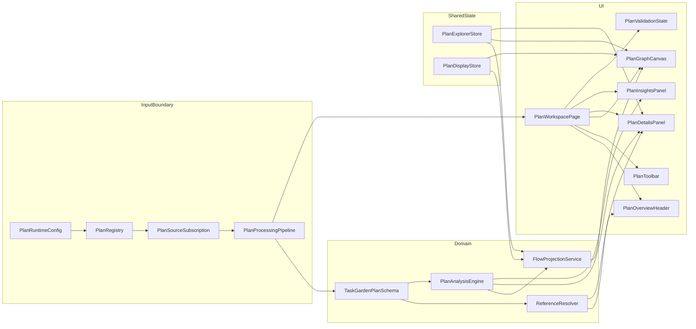
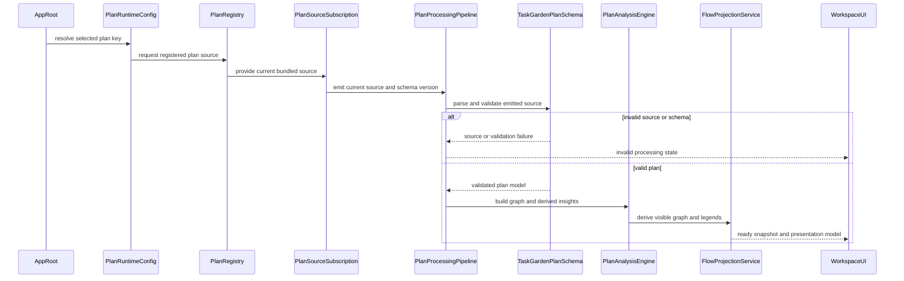
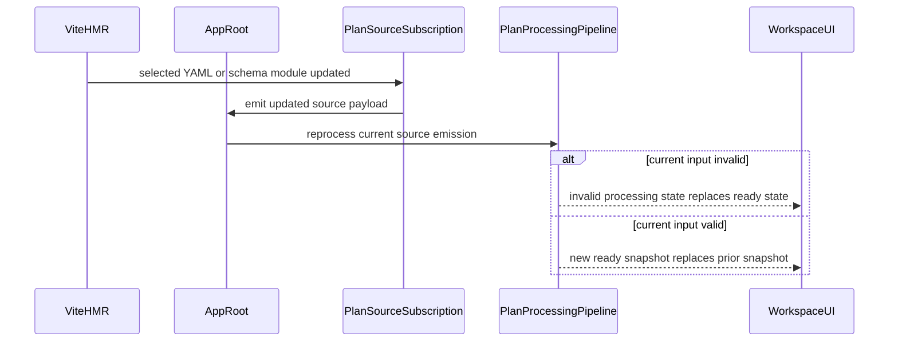
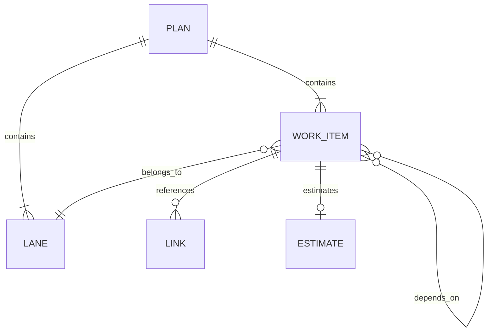

# Design Document

## Overview

Task Garden V1 is a client-only, single-user web application that loads one selected YAML project plan, validates it against the Task Garden plan specification, derives dependency analysis and graph metrics, and renders the result as an interactive atlas-style graph workspace. The feature delivers plan understanding rather than plan authoring: the app is optimized for reading, comparing, filtering, and structurally analyzing project work.

The primary users are individual developers iterating on planning files in local source control. They use the app to orient themselves to a plan, inspect work-item details, trace upstream and downstream dependencies, compare items visually across lanes and metrics, and review structural insights such as ordering, roots, leaves, and longest dependency chains.

This design preserves the project’s accepted boundaries: authored YAML remains the source of truth, Zod owns validation, Graphology owns dependency analysis, React Flow owns rendering, Tailwind CSS implements the Botanical Systems Atlas design system, and Zustand holds only shared UI state. The app shows exactly one selected plan per running instance, with YAML and schema edits hot-reloading during local development.

### Goals
- Load one selected bundled YAML plan per running app instance through a compile-time-safe plan registry.
- Reject invalid plans clearly, including missing lanes, missing dependencies, and dependency cycles.
- Render a readable lane-aware dependency graph with search, filters, scope controls, details, and structural insights.
- Support consistent color and node-size encodings driven by authored attributes and derived metrics.
- Keep authored data, validated models, derived analysis, and UI state as separate contracts so implementation work can be parallelized safely.

### Non-Goals
- In-browser plan editing or authoring
- In-app switching among plans without restarting the dev server
- Arbitrary filesystem path loading from the browser
- Backend APIs, databases, or SSR
- Import and export workflows
- Schedule-accurate critical-path analysis in the absence of standardized duration semantics

## Architecture

### Architecture Pattern & Boundary Map



**Architecture Integration**
- **Selected pattern**: Client-side processing pipeline with projection adapters. The runtime chooses the active plan, the pipeline validates and analyzes it, and the UI consumes only trusted snapshots plus small shared state stores.
- **Domain boundaries**:
  - Input boundary: runtime config, plan registry, processing state
  - Domain boundary: schema, DAG integrity, graph metrics, ordering, path analysis
  - Projection boundary: translate derived analysis plus UI settings into React Flow nodes, edges, legends, and visible subsets
  - UI boundary: page composition, controls, graph, details, and insights
- **Existing patterns preserved**: Feature-first structure, no monolithic store, strict validation at the file boundary, derived graph data outside authored YAML.
- **New components rationale**:
  - `PlanRuntimeConfig` and `PlanRegistry` make plan selection explicit and testable.
  - `PlanSourceSubscription` makes dev refresh a real contract and the single invalidation owner for YAML and schema HMR.
  - `PlanProcessingPipeline` prevents stale valid state from leaking into invalid sessions.
  - `ReferenceResolver` makes authored references followable in a client-only bundled app without assuming arbitrary repo path access.
  - `PlanAnalysisEngine` keeps graph logic reusable and independent of rendering.
  - `FlowProjectionService` isolates React Flow details from the domain model.
- **Steering compliance**: The design matches the steering requirement to keep authored input, validated models, derived analysis, and UI presentation state distinct.

### Technology Stack

| Layer | Choice / Version | Role in Feature | Notes |
|-------|------------------|-----------------|-------|
| Frontend | React + TypeScript | App shell, feature UI, typed contracts | Client-only SPA |
| Styling | Tailwind CSS v4 | Botanical Systems Atlas tokens and utilities | CSS-first `@theme` configuration |
| Validation | Zod v4 | Canonical plan schema and boundary validation | Use `.check()` for cross-record integrity |
| Parsing | `yaml` | Parse bundled authored YAML | Only used at the input boundary |
| Graph Rendering | `@xyflow/react` | Controlled node and edge rendering, viewport navigation, selection | Read-only interaction model |
| Graph Analysis | `graphology`, `graphology-dag`, Graphology metric packages | Canonical DAG representation, ordering, metrics | React Flow remains projection-only |
| Layout | `@dagrejs/dagre` | Initial DAG ordering and spacing hints | Preserve ELK upgrade path for future complexity |
| State | Zustand | Shared exploration and display state | No raw plan data in stores |
| Runtime / Tooling | Vite + Bun | Dev server, hot reload, package management | `VITE_PLAN_KEY` fixed at server start |
| Testing | Vitest + Playwright | Pure logic verification and UI workflow checks | Adjacent tests per feature |

## System Flows



Flow-level decisions:
- `PlanSourceSubscription` is the single trigger for pipeline reprocessing and emits a fresh processing input whenever the selected YAML or current schema module changes.
- Source loading, parse failures, and schema failures collapse into one explicit processing state contract so the app shell can switch cleanly between ready and invalid views.
- The analysis snapshot is computed once per valid plan version; UI state changes only recompute the projection layer.

```mermaid
sequenceDiagram
    participant User as User
    participant Stores as UIStores
    participant Projection as FlowProjectionService
    participant Graph as PlanGraphCanvas
    participant Details as PlanDetailsPanel
    participant Insights as PlanInsightsPanel

    User->>Stores: search filter select scope encode
    Stores->>Projection: apply exploration and display state
    Projection-->>Graph: nodes edges selection legend
    Projection-->>Details: selected item context
    Projection-->>Insights: ordering scope metrics legend
```

Flow-level decisions:
- Search, structured filters, relationship scope, and encoding mode are independent UI concerns that converge at projection time.
- The selected item ID is the coordination key between graph, details, and insights.



Flow-level decisions:
- YAML and schema edits hot-reload within the same selected plan context through one source-emission boundary rather than ad hoc app-level invalidation.
- Changing `VITE_PLAN_KEY` is outside this flow and requires a dev-server restart.

## Requirements Traceability

| Requirement | Summary | Components | Interfaces | Flows |
|-------------|---------|------------|------------|-------|
| 1.1 | Load selected YAML plan | PlanRuntimeConfig, PlanRegistry, PlanProcessingPipeline | Runtime config, Plan registry service | Load and Validate |
| 1.2 | Support different authored plans across runs | PlanRegistry, PlanRuntimeConfig | Plan registry service | Load and Validate |
| 1.3 | Show one selected plan per instance | PlanRuntimeConfig, PlanWorkspacePage | Runtime config state | Load and Validate |
| 1.4 | Show clear source-loading feedback | PlanProcessingPipeline, PlanValidationState | Processing state contract | Load and Validate |
| 2.1 | Show title summary and last updated | PlanWorkspacePage, PlanOverviewHeader | Processed plan snapshot | Load and Validate |
| 2.2 | Show plan references | ReferenceResolver, PlanOverviewHeader, PlanDetailsPanel | Plan metadata contract, reference resolution contract | Load and Validate |
| 2.3 | Identify defined lanes | PlanOverviewHeader, PlanToolbar, PlanGraphCanvas | Plan metadata contract | Load and Validate |
| 2.4 | Treat YAML as authoritative source | PlanRegistry, PlanProcessingPipeline, TaskGardenPlanSchema | Source and processing contracts | Load and Validate |
| 3.1 | Show validation feedback for invalid plan | PlanProcessingPipeline, TaskGardenPlanSchema, PlanValidationState | Processing state, validation failure contract | Load and Validate |
| 3.2 | Reject undefined dependency | TaskGardenPlanSchema, PlanValidationState | Validation failure contract | Load and Validate |
| 3.3 | Reject undefined lane | TaskGardenPlanSchema, PlanValidationState | Validation failure contract | Load and Validate |
| 3.4 | Reject dependency cycle | TaskGardenPlanSchema, PlanValidationState | Validation failure contract | Load and Validate |
| 3.5 | Do not show stale valid output on invalid input | PlanProcessingPipeline, PlanWorkspacePage | Processing state contract | Load and Validate, Dev Refresh |
| 4.1 | Render nodes and directed edges | FlowProjectionService, PlanGraphCanvas | Flow projection contract | Load and Validate, Explore and Encode |
| 4.2 | Use readable dependency layout | PlanAnalysisEngine, FlowProjectionService, PlanGraphCanvas | Analysis snapshot, flow projection | Load and Validate |
| 4.3 | Support graph navigation | PlanGraphCanvas | Graph viewport contract | Explore and Encode |
| 4.4 | Distinguish selected work item | PlanExplorerStore, FlowProjectionService, PlanGraphCanvas | Explorer state, flow projection | Explore and Encode |
| 4.5 | Label graph content clearly | FlowProjectionService, PlanGraphCanvas | Flow node data contract | Explore and Encode |
| 5.1 | Show each item lane | PlanAnalysisEngine, FlowProjectionService, PlanGraphCanvas, PlanDetailsPanel | Analysis snapshot, flow node data | Load and Validate, Explore and Encode |
| 5.2 | Distinguish items across lanes | FlowProjectionService, PlanGraphCanvas | Flow projection contract | Explore and Encode |
| 5.3 | Remain usable with one lane | FlowProjectionService, PlanGraphCanvas | Flow projection contract | Explore and Encode |
| 5.4 | Support plan-authored lane values | TaskGardenPlanSchema, PlanAnalysisEngine | Plan schema, analysis snapshot | Load and Validate |
| 6.1 | Search displayed text | PlanExplorerStore, FlowProjectionService, PlanToolbar | Explorer state, flow projection | Explore and Encode |
| 6.2 | Update visible set for active filters | PlanExplorerStore, FlowProjectionService, PlanGraphCanvas | Explorer state, flow projection | Explore and Encode |
| 6.3 | Filter by lane status priority tags | PlanExplorerStore, PlanToolbar, FlowProjectionService | Explorer state | Explore and Encode |
| 6.4 | Apply multiple filters together | PlanExplorerStore, FlowProjectionService | Explorer state | Explore and Encode |
| 6.5 | Show empty state for no matches | FlowProjectionService, PlanGraphCanvas, PlanValidationState | Flow projection contract | Explore and Encode |
| 7.1 | Show direct dependencies and dependents | PlanAnalysisEngine, PlanExplorerStore, PlanDetailsPanel | Analysis snapshot, explorer state | Explore and Encode |
| 7.2 | Scope to upstream chain | PlanExplorerStore, FlowProjectionService, PlanGraphCanvas | Explorer state, flow projection | Explore and Encode |
| 7.3 | Scope to downstream chain | PlanExplorerStore, FlowProjectionService, PlanGraphCanvas | Explorer state, flow projection | Explore and Encode |
| 7.4 | Scope to full chain | PlanExplorerStore, FlowProjectionService, PlanGraphCanvas | Explorer state, flow projection | Explore and Encode |
| 7.5 | Explain active scope | PlanToolbar, PlanGraphCanvas, PlanInsightsPanel | Explorer state, display legend | Explore and Encode |
| 8.1 | Show details on selection | PlanExplorerStore, PlanDetailsPanel | Explorer state | Explore and Encode |
| 8.2 | Show core fields and relationships | PlanAnalysisEngine, PlanDetailsPanel | Analysis snapshot | Explore and Encode |
| 8.3 | Show optional metadata | PlanDetailsPanel | Selected item detail contract | Explore and Encode |
| 8.4 | Allow following links and references | ReferenceResolver, PlanOverviewHeader, PlanDetailsPanel | Plan metadata, selected item detail, reference resolution contract | Explore and Encode |
| 8.5 | Show neutral details state | PlanDetailsPanel | Explorer state | Explore and Encode |
| 9.1 | Compute topological order | PlanAnalysisEngine | Analysis service | Load and Validate |
| 9.2 | Present topological order | PlanDisplayStore, PlanInsightsPanel | Display state, insights contract | Explore and Encode |
| 9.3 | Identify longest dependency chain | PlanAnalysisEngine, PlanInsightsPanel | Analysis snapshot | Load and Validate, Explore and Encode |
| 9.4 | Use longest dependency chain terminology | PlanInsightsPanel, FlowProjectionService | Insights contract, legend contract | Explore and Encode |
| 9.5 | Identify roots leaves and high-importance items | PlanAnalysisEngine, PlanInsightsPanel, FlowProjectionService | Analysis snapshot | Load and Validate, Explore and Encode |
| 9.6 | Compute graph metrics | PlanAnalysisEngine, FlowProjectionService | Analysis snapshot, flow projection | Load and Validate |
| 10.1 | Update graph for encoding mode | PlanDisplayStore, FlowProjectionService, PlanGraphCanvas | Display state, flow projection | Explore and Encode |
| 10.2 | Apply consistent attribute mapping | FlowProjectionService, PlanGraphCanvas | Flow projection contract | Explore and Encode |
| 10.3 | Apply consistent metric scale | PlanAnalysisEngine, FlowProjectionService | Analysis snapshot, flow projection | Load and Validate, Explore and Encode |
| 10.4 | Support color and node size comparison | PlanDisplayStore, FlowProjectionService, PlanGraphCanvas | Display state, flow projection | Explore and Encode |
| 10.5 | Explain active encoding | PlanToolbar, PlanInsightsPanel, PlanGraphCanvas | Display legend contract | Explore and Encode |
| 10.6 | Fall back when encoding data unavailable | FlowProjectionService, PlanInsightsPanel, PlanValidationState | Flow projection, display legend | Explore and Encode |
| 11.1 | Refresh when selected YAML changes in dev | PlanSourceSubscription, PlanProcessingPipeline, PlanWorkspacePage | Source emission, processing contracts | Dev Refresh |
| 11.2 | Refresh when plan specification changes in dev | PlanSourceSubscription, TaskGardenPlanSchema, PlanProcessingPipeline, PlanWorkspacePage | Source emission, processing state contract | Dev Refresh |
| 11.3 | Replace prior view when changed plan becomes invalid | PlanSourceSubscription, PlanProcessingPipeline, PlanValidationState | Source emission, processing state contract | Dev Refresh |
| 11.4 | Keep visible state synchronized with latest successful inputs | PlanSourceSubscription, PlanProcessingPipeline, PlanWorkspacePage, FlowProjectionService | Source emission, processing state, flow projection | Dev Refresh |

## Components and Interfaces

| Component | Domain / Layer | Intent | Req Coverage | Key Dependencies (P0/P1) | Contracts |
|-----------|----------------|--------|--------------|--------------------------|-----------|
| PlanRuntimeConfig | Input boundary | Resolve the selected plan key for the running app instance | 1.1, 1.3 | `import.meta.env` P0 | Service |
| PlanRegistry | Input boundary | Resolve the selected plan key to a bundled YAML document | 1.1, 1.2, 1.4, 11.1 | Vite glob registry P0 | Service |
| PlanSourceSubscription | Input boundary | Emit the current selected raw plan source and schema version for pipeline reprocessing | 11.1-11.4 | PlanRegistry P0, Vite HMR P0, schema version token P0 | Service, State |
| PlanProcessingPipeline | Input boundary | Convert a current source emission into either a ready snapshot or an invalid state | 1.4, 2.4, 3.1-3.5, 11.1-11.4 | `yaml` P0, `TaskGardenPlanSchema` P0, `PlanAnalysisEngine` P0 | Service, State |
| TaskGardenPlanSchema | Domain | Validate the authored plan contract, reference-target format, and DAG integrity | 2.4, 3.1-3.4, 5.4, 2.2, 8.4 | Zod v4 P0 | Service |
| ReferenceResolver | Domain | Resolve authored references into external URLs or bundled repo documents | 2.2, 8.4 | TaskGardenPlanSchema P0, Vite document registry P0 | Service |
| PlanAnalysisEngine | Domain | Build the canonical graph and derived insight snapshot | 4.2, 5.1-5.4, 7.1-7.4, 8.2, 9.1-9.6, 10.3 | Graphology P0, Graphology metrics P0 | Service |
| FlowProjectionService | Projection | Derive React Flow nodes, edges, legends, and visible subsets from analysis plus UI state | 4.1-4.5, 5.1-5.3, 6.1-6.5, 7.1-7.5, 10.1-10.6 | `@xyflow/react` P0, `PlanAnalysisEngine` P0, Dagre P1, stores P0 | Service |
| plan-explorer.store.ts | Shared state | Hold search, filters, selected item, and relationship scope | 4.4, 6.1-6.5, 7.1-7.5, 8.1-8.5 | Zustand P0 | State |
| plan-display.store.ts | Shared state | Hold color mode, size mode, and insight display mode | 9.2, 10.1-10.6 | Zustand P0 | State |
| PlanWorkspacePage | UI | Own processing-state switching and compose the workspace layout | 2.1-2.3, 3.5, 4.3, 11.1-11.4 | `PlanProcessingPipeline` P0 | State |
| PlanOverviewHeader | UI | Present plan identity, summary, references, and selected plan context | 2.1-2.3, 8.4 | Ready snapshot P0 | State |
| PlanToolbar | UI | Present search, structured filters, scope controls, and encoding controls | 6.1-6.5, 7.5, 9.2, 10.1-10.6 | Stores P0, `FlowProjectionService` P1 | State |
| PlanGraphCanvas | UI | Render the visible graph and support viewport navigation and selection | 4.1-4.5, 5.1-5.3, 6.2, 7.1-7.5, 10.1-10.6 | React Flow P0, projection P0 | State |
| PlanDetailsPanel | UI | Show neutral or selected-item details and relationship links | 5.1, 7.1, 8.1-8.5 | Explorer store P0, analysis snapshot P0 | State |
| PlanInsightsPanel | UI | Show ordering, longest-chain, root/leaf, and metric insights plus legends | 7.5, 9.2-9.6, 10.5-10.6 | Display store P0, analysis snapshot P0 | State |
| PlanValidationState | UI | Show source-loading, parse, validation, and empty-state feedback | 1.4, 3.1-3.5, 6.5, 10.6, 11.3 | Processing state P0 | State |

### Input Boundary

#### PlanRuntimeConfig

| Field | Detail |
|-------|--------|
| Intent | Resolve the selected plan key from the runtime environment |
| Requirements | 1.1, 1.3 |

**Responsibilities & Constraints**
- Own the typed `VITE_PLAN_KEY` contract.
- Fail fast if the selected plan key is absent.
- Avoid any filesystem or URL-based dynamic path interpretation.

**Dependencies**
- External: Vite env contract — expose `VITE_PLAN_KEY` to client code (P0)

**Contracts**: Service [x] / API [ ] / Event [ ] / Batch [ ] / State [ ]

##### Service Interface
```typescript
type PlanKey = string;

type RuntimeConfigError =
  | { type: "missing_plan_key"; message: string };

type Result<T, E> =
  | { ok: true; value: T }
  | { ok: false; error: E };

interface RuntimeConfigValue {
  planKey: PlanKey;
}

interface PlanRuntimeConfigService {
  resolve(): Result<RuntimeConfigValue, RuntimeConfigError>;
}
```
- Preconditions: `ImportMetaEnv` declares `VITE_PLAN_KEY`.
- Postconditions: Successful resolution returns exactly one plan key.
- Invariants: The plan key is treated as stable for the lifetime of the running app instance.

**Implementation Notes**
- Integration: The app shell calls this once during startup and passes the result into the registry layer.
- Validation: Missing env state becomes source-loading feedback, not a silent fallback.
- Risks: Bun’s env-loading behavior can hide configuration mistakes if the project does not document restart expectations.

#### PlanRegistry

| Field | Detail |
|-------|--------|
| Intent | Resolve a selected plan key to a bundled raw YAML document and source metadata |
| Requirements | 1.1, 1.2, 1.4, 11.1 |

**Responsibilities & Constraints**
- Own the compile-time map of known plans.
- Keep source metadata stable enough for display and error reporting.
- Never read arbitrary files outside the registered plan set.

**Dependencies**
- Inbound: `PlanRuntimeConfig` — selected plan key (P0)
- External: Vite glob-import registry — bundled raw YAML modules (P0)

**Contracts**: Service [x] / API [ ] / Event [ ] / Batch [ ] / State [ ]

##### Service Interface
```typescript
interface RegisteredPlanSource {
  planKey: PlanKey;
  sourcePath: string;
  displayName: string;
  rawDocument: string;
}

type PlanSourceError =
  | { type: "plan_not_registered"; planKey: PlanKey; message: string }
  | { type: "plan_source_unavailable"; planKey: PlanKey; message: string };

interface PlanRegistryService {
  resolve(planKey: PlanKey): Result<RegisteredPlanSource, PlanSourceError>;
  list(): readonly RegisteredPlanSource[];
}
```
- Preconditions: Registry keys are unique and compile-time discoverable.
- Postconditions: Success returns raw YAML and source metadata for one selected plan.
- Invariants: A running instance resolves only one plan source at a time.

**Implementation Notes**
- Integration: Implemented in `src/lib/plan/` and reused by the app shell and future tooling.
- Validation: Missing plan keys are surfaced as source-loading failures.
- Risks: Registry naming drift will confuse developers unless plan keys stay explicit and documented.

#### PlanSourceSubscription

| Field | Detail |
|-------|--------|
| Intent | Emit the current selected raw source plus refresh metadata whenever the selected YAML or schema changes |
| Requirements | 11.1-11.4 |

**Responsibilities & Constraints**
- Own the reactive dev-refresh contract for the current selected plan.
- Emit one authoritative processing input that combines the selected raw source with the active schema version token.
- Avoid duplicating HMR invalidation logic across app components.

**Dependencies**
- Inbound: `PlanRegistry` — selected registered plan source (P0)
- External: Vite HMR runtime — module refresh notifications (P0)
- External: schema version token — current plan-schema module revision (P0)

**Contracts**: Service [x] / API [ ] / Event [ ] / Batch [ ] / State [x]

##### State Management
```typescript
interface PlanSourceEmission {
  source: RegisteredPlanSource;
  sourceVersion: string;
  schemaVersion: string;
  refreshKey: string;
}

interface PlanSourceSubscription {
  useSelectedPlanSource(
    planKey: PlanKey,
  ): Result<PlanSourceEmission, PlanSourceError>;
}
```
- Preconditions: The plan key is already resolved from runtime config.
- Postconditions: Every relevant YAML or schema change produces a new `refreshKey`.
- Invariants: The pipeline reprocesses only from this emission contract, never from ad hoc component effects.

**Implementation Notes**
- Integration: `PlanWorkspacePage` consumes this hook or service and passes the current emission into the processing pipeline.
- Validation: Source-resolution failures are surfaced through the same boundary so dev refresh does not fork the error path.
- Risks: Splitting HMR invalidation across the page shell and feature modules would reintroduce stale-state drift.

#### PlanProcessingPipeline

| Field | Detail |
|-------|--------|
| Intent | Convert one current source emission into a ready snapshot or an invalid state |
| Requirements | 1.4, 2.4, 3.1-3.5, 11.1-11.4 |

**Responsibilities & Constraints**
- Parse raw YAML into a plain object.
- Validate through the Task Garden schema boundary.
- Build a derived analysis snapshot only after successful validation.
- Replace prior ready state whenever the current source becomes invalid.
- Treat source and schema version changes identically as reprocessing triggers.

**Dependencies**
- Inbound: `PlanSourceSubscription` — current source emission (P0)
- Outbound: `TaskGardenPlanSchema` — validation (P0)
- Outbound: `PlanAnalysisEngine` — graph analysis (P0)
- External: `yaml` — YAML parsing (P0)

**Contracts**: Service [x] / API [ ] / Event [ ] / Batch [ ] / State [x]

##### Service Interface
```typescript
interface PlanProcessingReady {
  status: "ready";
  source: PlanSourceEmission;
  snapshot: PlanAnalysisSnapshot;
}

interface PlanProcessingInvalid {
  status: "invalid";
  source: PlanSourceEmission | null;
  failure: PlanProcessingFailure;
}

interface PlanProcessingLoading {
  status: "loading";
  planKey: PlanKey;
}

type PlanProcessingState =
  | PlanProcessingLoading
  | PlanProcessingReady
  | PlanProcessingInvalid;

type PlanProcessingFailure =
  | { type: "source"; issues: string[] }
  | { type: "parse"; issues: string[] }
  | { type: "validation"; issues: ValidationIssue[] };

interface PlanProcessingPipelineService {
  process(source: PlanSourceEmission): PlanProcessingState;
}
```
- Preconditions: Source metadata is available before processing begins.
- Postconditions: Ready state always contains validated data and derived analysis; invalid state never exposes stale ready data.
- Invariants: Processing is deterministic for a given source text and schema version.

**Implementation Notes**
- Integration: The app shell owns this pipeline and uses source-emission changes as the single reprocessing trigger.
- Validation: Validation failures retain source metadata when possible so the user can identify the broken file.
- Risks: Mixing parse, validation, and analysis concerns in one UI component would reintroduce stale-state bugs.

### Domain

#### TaskGardenPlanSchema

| Field | Detail |
|-------|--------|
| Intent | Define the authored plan contract and enforce cross-record graph integrity |
| Requirements | 2.2, 2.4, 3.1-3.4, 5.4, 8.4 |

**Responsibilities & Constraints**
- Define the authoritative authored YAML shape.
- Validate reference targets as either absolute `http` or `https` URLs or allowlisted repo-relative Markdown document paths.
- Validate lane existence, dependency existence, duplicate IDs, duplicate dependencies, self-dependencies, and DAG acyclicity.
- Keep derived fields out of the authored contract.

**Dependencies**
- External: Zod v4 — typed schema and `.check()` integrity validation (P0)

**Contracts**: Service [x] / API [ ] / Event [ ] / Batch [ ] / State [ ]

##### Service Interface
```typescript
type ReferenceTarget = string;

interface ValidationIssue {
  path: readonly (string | number)[];
  code: string;
  message: string;
}

interface TaskGardenPlan {
  version: 1;
  plan_id: string;
  title: string;
  last_updated: string;
  summary: string;
  references: readonly ReferenceTarget[];
  lanes: readonly TaskGardenLane[];
  work_items: readonly TaskGardenWorkItem[];
}

interface TaskGardenLane {
  id: string;
  label: string;
  description?: string;
  color?: string;
}

interface TaskGardenWorkItem {
  id: string;
  title: string;
  summary: string;
  lane: string;
  status: "planned" | "ready" | "blocked" | "in_progress" | "done" | "future";
  priority: "p0" | "p1" | "p2" | "p3" | "nice_to_have";
  depends_on: readonly string[];
  tags: readonly string[];
  estimate?: TaskGardenEstimate;
  deliverables: readonly string[];
  reuse_candidates: readonly string[];
  links: readonly TaskGardenLink[];
  notes?: string;
}

interface TaskGardenEstimate {
  value: number;
  unit: "hours" | "days" | "points";
}

interface TaskGardenLink {
  label: string;
  href: ReferenceTarget;
}

interface TaskGardenPlanSchemaService {
  parse(input: unknown): Result<TaskGardenPlan, readonly ValidationIssue[]>;
}
```
- Preconditions: Input is plain parsed YAML data.
- Postconditions: Success returns a fully trusted plan model.
- Invariants: IDs are stable keys; dependency edges reference existing work items only; the graph is acyclic.

**Implementation Notes**
- Integration: Defined in `src/lib/plan/task-garden-plan.schema.ts` and imported only at the processing boundary and in tests.
- Validation: Use Zod base field validation plus `.check()` for plan-level integrity rules, including allowed reference-target format.
- Risks: Letting projection or UI code attach derived fields back onto the validated model would violate the authored/derived boundary.

#### ReferenceResolver

| Field | Detail |
|-------|--------|
| Intent | Resolve authored references into followable targets that work in a bundled client-only app |
| Requirements | 2.2, 8.4 |

**Responsibilities & Constraints**
- Resolve external URLs without altering them.
- Resolve allowlisted repo-relative Markdown paths against a bundled document registry.
- Return an explicit unresolved result when a target is well-formed but not present in the bundled document set.

**Dependencies**
- Inbound: `TaskGardenPlanSchema` — validated reference targets (P0)
- External: Vite glob-import registry for bundled Markdown documents (P0)

**Contracts**: Service [x] / API [ ] / Event [ ] / Batch [ ] / State [ ]

##### Service Interface
```typescript
type ResolvedReference =
  | {
      kind: "external_url";
      label: string;
      href: string;
    }
  | {
      kind: "bundled_document";
      label: string;
      documentPath: string;
      rawDocument: string;
    };

type ReferenceResolutionFailure =
  | { type: "unsupported_target_format"; target: ReferenceTarget; message: string }
  | { type: "document_not_registered"; target: ReferenceTarget; message: string };

interface ReferenceResolverService {
  resolve(
    target: ReferenceTarget,
    label: string,
  ): Result<ResolvedReference, ReferenceResolutionFailure>;
}
```
- Preconditions: Reference targets have already passed schema format validation.
- Postconditions: Successful resolution returns a followable external link or bundled document payload.
- Invariants: Repo-relative resolution is limited to bundled Markdown documents and never falls through to arbitrary path access.

**Implementation Notes**
- Integration: `PlanOverviewHeader` and `PlanDetailsPanel` call this service before rendering followable references.
- Validation: Unresolvable document targets render a disabled reference state with explanatory feedback instead of a broken link.
- Risks: Allowing arbitrary repo-relative resolution would fail in production builds and break the client-only boundary.

#### PlanAnalysisEngine

| Field | Detail |
|-------|--------|
| Intent | Build the canonical graph and all derived structural insights for one validated plan |
| Requirements | 4.2, 5.1-5.4, 7.1-7.4, 8.2, 9.1-9.6, 10.3 |

**Responsibilities & Constraints**
- Create one canonical Graphology DAG from validated work items and dependencies.
- Derive dependents, topological order, levels, roots, leaves, longest dependency chain, and normalized metrics.
- Preserve authored metadata while keeping derived fields in a separate snapshot contract.

**Dependencies**
- Inbound: `TaskGardenPlanSchema` — validated plan model (P0)
- External: Graphology — canonical graph model (P0)
- External: Graphology metric packages — degree and centrality metrics (P0)

**Contracts**: Service [x] / API [ ] / Event [ ] / Batch [ ] / State [ ]

##### Service Interface
```typescript
type MetricKey =
  | "degree"
  | "in_degree"
  | "out_degree"
  | "betweenness"
  | "dependency_span";

interface WorkItemAnalysis {
  id: string;
  dependencyIds: readonly string[];
  dependentIds: readonly string[];
  level: number;
  topologicalIndex: number;
  isRoot: boolean;
  isLeaf: boolean;
  metrics: Readonly<Record<MetricKey, number>>;
}

interface LongestDependencyChain {
  workItemIds: readonly string[];
  length: number;
  label: "longest_dependency_chain";
}

interface PlanAnalysisSnapshot {
  plan: TaskGardenPlan;
  workItems: Readonly<Record<string, TaskGardenWorkItem>>;
  analysisById: Readonly<Record<string, WorkItemAnalysis>>;
  topologicalOrder: readonly string[];
  roots: readonly string[];
  leaves: readonly string[];
  laneOrder: readonly string[];
  longestDependencyChain: LongestDependencyChain;
  metricRanges: Readonly<Record<MetricKey, { min: number; max: number }>>;
}

interface PlanAnalysisEngineService {
  build(plan: TaskGardenPlan): PlanAnalysisSnapshot;
}
```
- Preconditions: Input plan has already passed all schema checks.
- Postconditions: The snapshot contains every derived value required for graph rendering, details, and insights.
- Invariants: The snapshot remains read-only and corresponds to exactly one validated plan version.

**Implementation Notes**
- Integration: Pure domain module in `src/lib/graph/`; reused by both UI and non-UI tests.
- Validation: No schema correction occurs here; internal invariant failures should surface during testing instead of being hidden.
- Risks: Metric calculation cost grows with plan size, so snapshot building must happen once per valid plan update rather than per UI interaction.

#### FlowProjectionService

| Field | Detail |
|-------|--------|
| Intent | Translate the analysis snapshot and UI state into a React Flow presentation model |
| Requirements | 4.1-4.5, 5.1-5.3, 6.1-6.5, 7.1-7.5, 10.1-10.6 |

**Responsibilities & Constraints**
- Apply search, structured filters, relationship scope, selection, lane bands, and visual encodings.
- Produce React Flow node and edge data without mutating the analysis snapshot.
- Return display legends and explanatory fallback messages for unavailable encodings.

**Dependencies**
- Inbound: `PlanAnalysisEngine` — analysis snapshot (P0)
- Inbound: `plan-explorer.store.ts` — search, filters, scope, selection (P0)
- Inbound: `plan-display.store.ts` — encoding and insight display settings (P0)
- External: React Flow types — renderable nodes and edges (P0)
- External: Dagre — lane-aware DAG layout hints (P1)

**Contracts**: Service [x] / API [ ] / Event [ ] / Batch [ ] / State [ ]

##### Service Interface
```typescript
type GraphScope = "all" | "upstream" | "downstream" | "chain";

type ColorEncodingMode =
  | "default"
  | "lane"
  | "status"
  | "priority"
  | "degree"
  | "betweenness"
  | "dependency_span";

type SizeEncodingMode =
  | "uniform"
  | "degree"
  | "betweenness"
  | "dependency_span";

interface PlanExplorerStateValue {
  selectedWorkItemId: string | null;
  searchQuery: string;
  activeScope: GraphScope;
  laneIds: readonly string[];
  statuses: readonly TaskGardenWorkItem["status"][];
  priorities: readonly TaskGardenWorkItem["priority"][];
  tags: readonly string[];
}

interface PlanDisplayStateValue {
  colorMode: ColorEncodingMode;
  sizeMode: SizeEncodingMode;
  insightMode: "overview" | "ordering" | "metrics";
}

interface FlowNodeData {
  id: string;
  title: string;
  laneLabel: string;
  status: TaskGardenWorkItem["status"];
  priority: TaskGardenWorkItem["priority"];
  summary: string;
  metricSummary: Readonly<Record<MetricKey, number>>;
  isSelected: boolean;
  visibilityRole: "focus" | "context";
}

interface FlowNode {
  id: string;
  position: { x: number; y: number };
  data: FlowNodeData;
}

interface FlowEdge {
  id: string;
  source: string;
  target: string;
  isHighlighted: boolean;
}

interface DisplayLegend {
  title: string;
  items: readonly { key: string; label: string; value: string }[];
  fallbackMessage?: string;
}

interface FlowProjection {
  nodes: readonly FlowNode[];
  edges: readonly FlowEdge[];
  emptyStateMessage: string | null;
  legend: DisplayLegend;
  summary: {
    focusNodeCount: number;
    contextNodeCount: number;
    hiddenNodeCount: number;
    hiddenEdgeCount: number;
    selectedNodeFilteredOut: boolean;
  };
}

interface FlowProjectionService {
  project(
    snapshot: PlanAnalysisSnapshot,
    explorer: PlanExplorerStateValue,
    display: PlanDisplayStateValue,
  ): FlowProjection;
}
```
- Preconditions: Projection inputs reference the same current analysis snapshot.
- Postconditions: Output contains only the visible graph subset and the legend that explains the current encoding.
- Invariants: Encodings are deterministic for a given snapshot and display state.

**Implementation Notes**
- Integration: Projection is recomputed whenever shared UI state changes or a new ready snapshot arrives. Dagre layout positions are cached by the visible node and edge set and reused for styling-only updates such as selection and encoding changes.
- Projection semantics:
  - If `selectedWorkItemId` is `null`, `activeScope` is treated as `all`.
  - The base candidate set is the full graph for `all`, or the selected node's upstream, downstream, or full-chain neighborhood for scoped exploration.
  - Search and structured filters apply conjunctively inside the base candidate set to produce the `focus` set.
  - The `context` set keeps structural context visible without redefining the match result:
    - in `all`, include direct dependencies and direct dependents of focus nodes
    - in `upstream`, `downstream`, and `chain`, include nodes and edges needed to preserve the scoped path between the selected item and focus matches
    - always keep the selected item visible as `context` when it falls outside the active search or filters
  - Nodes and edges outside the `focus` and `context` sets are hidden, and the projection summary returns hidden counts.
  - If no nodes match the active search and filter criteria, `emptyStateMessage` is set even if a filtered-out selection remains visible as context.
- Validation: Unsupported or degenerate encodings return a readable default legend with a fallback message.
- Risks: Projection logic can grow noisy if search, scope, lane, edge highlighting, and encoding rules are mixed into UI components instead of remaining centralized.

### Shared State

#### plan-explorer.store.ts

| Field | Detail |
|-------|--------|
| Intent | Hold cross-panel exploration state for selection, search, filters, and scope |
| Requirements | 4.4, 6.1-6.5, 7.1-7.5, 8.1-8.5 |

**Responsibilities & Constraints**
- Keep selection and scope stable across the graph, details panel, and insights panel.
- Apply structured filters as a combined conjunction.
- Reset `activeScope` to `all` whenever selection is cleared.
- Use event-shaped actions rather than generic setters.

**Dependencies**
- Inbound: UI controls — user events (P0)
- Outbound: `FlowProjectionService` — exploration input (P0)
- External: Zustand — shared state store (P0)

**Contracts**: Service [ ] / API [ ] / Event [ ] / Batch [ ] / State [x]

##### State Management
- State model:
  - `selectedWorkItemId: string | null`
  - `searchQuery: string`
  - `activeScope: "all" | "upstream" | "downstream" | "chain"`
  - `laneIds: string[]`
  - `statuses: TaskGardenStatus[]`
  - `priorities: TaskGardenPriority[]`
  - `tags: string[]`
- Persistence & consistency: In-memory only for the current session.
- Concurrency strategy: Single-client synchronous updates; no external synchronization.

**Implementation Notes**
- Integration: Export selectors alongside the store so components do not over-subscribe.
- Validation: The store never owns raw plan data; filter options are derived from the current ready snapshot.
- Risks: Overloading this store with analysis data would violate steering and increase re-render pressure.

#### plan-display.store.ts

| Field | Detail |
|-------|--------|
| Intent | Hold cross-panel display state for color, size, and insight presentation |
| Requirements | 9.2, 10.1-10.6 |

**Responsibilities & Constraints**
- Keep graph comparison modes consistent across graph and insight surfaces.
- Hold only shared presentation concerns.
- Provide intentful actions for changing encodings.

**Dependencies**
- Inbound: Toolbar and insight controls — user events (P0)
- Outbound: `FlowProjectionService` — display input (P0)
- External: Zustand — shared state store (P0)

**Contracts**: Service [ ] / API [ ] / Event [ ] / Batch [ ] / State [x]

##### State Management
- State model:
  - `colorMode: "default" | "lane" | "status" | "priority" | "degree" | "betweenness" | "dependency_span"`
  - `sizeMode: "uniform" | "degree" | "betweenness" | "dependency_span"`
  - `insightMode: "overview" | "ordering" | "metrics"`
- Persistence & consistency: In-memory only for the current session.
- Concurrency strategy: Single-client synchronous updates.

**Implementation Notes**
- Integration: The insight panel and graph legend consume the same display state so explanations stay consistent.
- Validation: Unsupported display modes fall back in projection, not in the store.
- Risks: Combining exploration and display concerns in one store would obscure event ownership and complicate tests.

### UI

#### PlanWorkspacePage

| Field | Detail |
|-------|--------|
| Intent | Compose the page shell and switch between loading, invalid, and ready states |
| Requirements | 2.1-2.3, 3.5, 4.3, 11.1-11.4 |

**Responsibilities & Constraints**
- Own the local processing-state boundary.
- Own the active bundled-document preview state for resolved repo-relative references.
- Render the Botanical Systems Atlas shell consistently across ready and invalid states.
- Keep ready-only controls unavailable while the current input is invalid.

**Implementation Notes**
- Integration: Root page in `src/app/` composes the feature modules and theme layer, consumes `PlanSourceSubscription`, and opens bundled-document references in a page-owned preview surface.
- Validation: State switching is keyed only to the processing-state contract.
- Risks: Mixing invalid and ready UI surfaces on the same page would violate the stale-state requirement.

#### PlanOverviewHeader

| Field | Detail |
|-------|--------|
| Intent | Present plan identity, references, lane summary, and selected plan context |
| Requirements | 2.1-2.3, 8.4 |

**Implementation Notes**
- Integration: Summary-only presentational component fed by the ready snapshot and resolved references.
- Validation: References render only after `ReferenceResolver` returns a followable target or an explicit unresolved result.
- Risks: None beyond standard content truncation and responsive layout concerns.

#### PlanToolbar

| Field | Detail |
|-------|--------|
| Intent | Present search, filters, scope controls, and encoding controls in one consistent control rail |
| Requirements | 6.1-6.5, 7.5, 9.2, 10.1-10.6 |

**Implementation Notes**
- Integration: Reads store selectors and dispatches store actions.
- Validation: Filter options derive from the current ready snapshot; empty or unavailable options render as disabled or omitted.
- Validation: Toolbar summary may surface hidden counts and filtered-out-selection state from the projection summary when needed.
- Risks: Control density can overwhelm small screens without disciplined responsive layout.

#### PlanGraphCanvas

| Field | Detail |
|-------|--------|
| Intent | Render the current graph projection and handle viewport and selection interactions |
| Requirements | 4.1-4.5, 5.1-5.3, 6.2, 7.1-7.5, 10.1-10.6 |

**Implementation Notes**
- Integration: Consumes the projection output and display legend, then passes selection events back to the explorer store.
- Validation: The canvas styles `focus` and `context` nodes differently and uses edge highlight state from the projection contract rather than deriving it locally.
- Risks: Dense graphs may require additional edge simplification or future layout changes.

#### PlanDetailsPanel

| Field | Detail |
|-------|--------|
| Intent | Show either a neutral study-sheet state or a selected item’s details and relationships |
| Requirements | 5.1, 7.1, 8.1-8.5 |

**Implementation Notes**
- Integration: Uses the selected item ID plus the analysis snapshot and projection summary.
- Validation: Relationship links use canonical work-item IDs so graph selection and details navigation stay aligned.
- Validation: If the selected item is shown only as context because it does not match active filters, the panel stays anchored to that selection and displays a context-only banner.
- Risks: Overloading the details panel with low-value metrics would reduce clarity.

#### PlanInsightsPanel

| Field | Detail |
|-------|--------|
| Intent | Present ordering, longest-chain, root and leaf, and metric-based structural insights |
| Requirements | 7.5, 9.2-9.6, 10.5-10.6 |

**Implementation Notes**
- Integration: Reads the analysis snapshot plus display state for legends and ordering mode, and may surface filtered-out-selection status from the projection summary.
- Validation: The panel labels V1 path results as longest dependency chain, not critical path.
- Risks: Insight definitions must stay concise so they remain actionable rather than academic.

#### PlanValidationState

| Field | Detail |
|-------|--------|
| Intent | Present source, parse, validation, and empty-state feedback clearly |
| Requirements | 1.4, 3.1-3.5, 6.5, 10.6, 11.3 |

**Implementation Notes**
- Integration: Reused for invalid plan states and empty filtered projections where appropriate.
- Validation: Validation issues remain grouped by type and preserve path context when available.
- Risks: Conflating invalid input with empty filter results would confuse recovery actions.

## Data Models

### Domain Model

Task Garden has one authored aggregate per loaded plan. The aggregate consists of plan metadata, a lane collection, and a work-item collection with dependency edges defined by `depends_on`. Derived graph analysis is not persisted back into the authored model.



Business rules and invariants:
- `plan_id`, `lane.id`, and `work_item.id` are stable slug identifiers.
- `lane.id` values are unique within a plan.
- `work_item.id` values are unique within a plan.
- Every work item belongs to exactly one authored lane.
- Every dependency points to an existing work item and the graph is acyclic.
- Derived fields such as dependents, levels, topological order, roots, leaves, and metrics are computed after validation and never authored in YAML.

### Logical Data Model

**Structure Definition**
- `TaskGardenPlan`
  - `version: 1`
  - `plan_id: string`
  - `title: string`
  - `last_updated: YYYY-MM-DD string`
  - `summary: string`
  - `references: string[]`
  - `lanes: TaskGardenLane[]`
  - `work_items: TaskGardenWorkItem[]`
- `TaskGardenLane`
  - `id: string`
  - `label: string`
  - `description?: string`
  - `color?: string`
- `TaskGardenWorkItem`
  - `id: string`
  - `title: string`
  - `summary: string`
  - `lane: string`
  - `status: enum`
  - `priority: enum`
  - `depends_on: string[]`
  - `tags: string[]`
  - `estimate?: { value: number; unit: enum }`
  - `deliverables: string[]`
  - `reuse_candidates: string[]`
  - `links: { label: string; href: string }[]`
  - `notes?: string`

**Consistency & Integrity**
- Transaction boundary: the entire plan document is the atomic validation unit.
- Cascading rules: if the current plan fails validation, no prior ready snapshot remains visible.
- Temporal aspects: `last_updated` is authored metadata only; there is no separate runtime persistence layer in V1.

### Data Contracts & Integration

**API Data Transfer**
- No backend API exists in V1.

**Event Schemas**
- No external event bus exists in V1.

**Cross-Service Data Management**
- No distributed data synchronization exists in V1.

**Internal Contracts**
- `PlanProcessingState`
  - `loading`: waiting for the selected source to process
  - `invalid`: current source cannot produce a ready snapshot
  - `ready`: trusted snapshot plus derived analysis
- `PlanAnalysisSnapshot`
  - Canonical validated plan
  - `analysisById`
  - `topologicalOrder`
  - `roots`
  - `leaves`
  - `longestDependencyChain`
  - `metricRanges`
  - `laneOrder`
- `FlowProjection`
  - visible renderable nodes and edges
  - focus and context visibility roles
  - lane-aware layout metadata
  - selected node presentation
  - edge highlighting state for selected-neighborhood and active-scope emphasis
  - hidden counts and filtered-out-selection state
  - legend and fallback explanation
  - empty-state message when filters match nothing

## Error Handling

### Error Strategy
- **Source errors**: Missing `VITE_PLAN_KEY`, unknown plan key, or unavailable bundled source become source-loading feedback in `PlanValidationState`.
- **Parse errors**: YAML syntax failures are surfaced as current-input failures with actionable issue text.
- **Validation errors**: Schema and graph-integrity issues are grouped and displayed with issue paths when available.
- **Projection errors**: Unsupported encodings or degenerate metric ranges fall back to the default presentation plus an explanation, rather than breaking graph rendering.
- **Reference resolution errors**: Well-formed but unregistered repo-relative documents render as disabled references with explanatory feedback.
- **Invariant failures**: Internal analysis invariants are allowed to fail loudly during development and tests rather than being silently swallowed.

### Error Categories and Responses
- **User errors**: Invalid authored YAML, undefined lanes, undefined dependencies, duplicate IDs, duplicate dependencies, or cycles produce corrective validation feedback.
- **System errors**: Missing runtime configuration or unavailable registered plan source produce source-loading feedback.
- **Business logic errors**: Unsupported encoding selections, unregistered repo-relative references, or empty filtered results produce readable default UI with explanatory messaging.

### Monitoring
- V1 uses boundary-level development logging only:
  - runtime config resolution failures
  - source resolution failures
  - parse failures
  - validation issue counts by category
  - analysis timing and projection timing in development builds
- No remote telemetry is required for V1.

## Testing Strategy

### Unit Tests
- `PlanRuntimeConfig` resolves a typed `VITE_PLAN_KEY` and fails clearly when missing.
- `PlanRegistry` returns the expected bundled plan source and rejects unknown keys.
- `PlanSourceSubscription` emits a new refresh key when the selected YAML or schema version changes.
- `TaskGardenPlanSchema` rejects missing lanes, missing dependencies, invalid reference-target formats, self-dependencies, duplicate dependencies, duplicate IDs, and cycles.
- `ReferenceResolver` resolves external URLs and bundled Markdown documents and reports unregistered documents explicitly.
- `PlanAnalysisEngine` computes topological order, roots, leaves, dependents, longest dependency chain, and normalized metric ranges correctly.
- `FlowProjectionService` applies selection, filters, scope, focus-versus-context rules, and encoding rules consistently and returns fallback legends when needed.
- `FlowProjectionService` highlights scope-relevant edges correctly and invalidates cached layout only when the visible node or edge set changes.

### Integration Tests
- A valid selected plan produces a ready snapshot with overview metadata, graph content, and details-panel support.
- An invalid current plan source replaces the prior ready view with validation feedback.
- Search and structured filters combine correctly and produce the expected visible subset.
- Search and structured filters preserve selected-node and path context according to the projection summary rules.
- Upstream, downstream, and full-chain scopes constrain the projection correctly for a selected item.
- Relationship-scoped exploration marks the relevant visible edges as highlighted.
- Repo-relative references resolve to bundled document previews while external URLs remain followable as links.
- Color and size encoding modes update legend output and projected node presentation consistently.

### E2E / UI Tests
- The app boots with the configured `VITE_PLAN_KEY` and shows the selected plan context.
- Selecting a graph node opens the details panel and enables relationship-scoped exploration.
- Search, lane filters, and status or priority filters combine and show a clear empty state when nothing matches.
- A selected node that no longer matches active filters remains visible as context and is explained consistently across graph and details.
- Encoding changes update the graph legend and node appearance without leaving the page.
- Editing the selected YAML plan or schema during development refreshes the visible state to either a new ready snapshot or a validation state through the source-emission boundary.

### Performance / Load
- Initial processing should remain responsive for typical single-user plans in the low hundreds of work items on a modern development machine.
- UI-only interactions such as selection, filter updates, and encoding changes should avoid full re-validation and full metric recomputation.
- The projection layer should separate layout from styling so cached Dagre positions are reused for selection and encoding changes, while visible node or edge set changes invalidate layout.

## Security Considerations

- Plan selection is key-based, not path-based, so the browser app never receives arbitrary filesystem access.
- V1 reads only bundled local sources and does not fetch remote plan data.
- Repo-relative references are restricted to bundled Markdown documents, not arbitrary repository files.
- External links defined in the plan are rendered as authored references, not elevated into executable application behavior.

## Performance & Scalability

- The most expensive operations are graph construction, topological analysis, and centrality metrics. These occur only when the ready snapshot changes.
- The projection layer absorbs high-frequency UI changes so search and encoding updates do not rebuild the canonical graph.
- Dagre layout is recomputed only when the visible graph topology changes, such as plan refresh, filter changes, search changes that alter the visible set, or relationship-scope changes. Styling-only updates reuse cached positions.
- Dagre is sufficient for V1, but the design preserves an upgrade seam to ELK if real plans exceed the readability envelope of lane-aware Dagre output.
